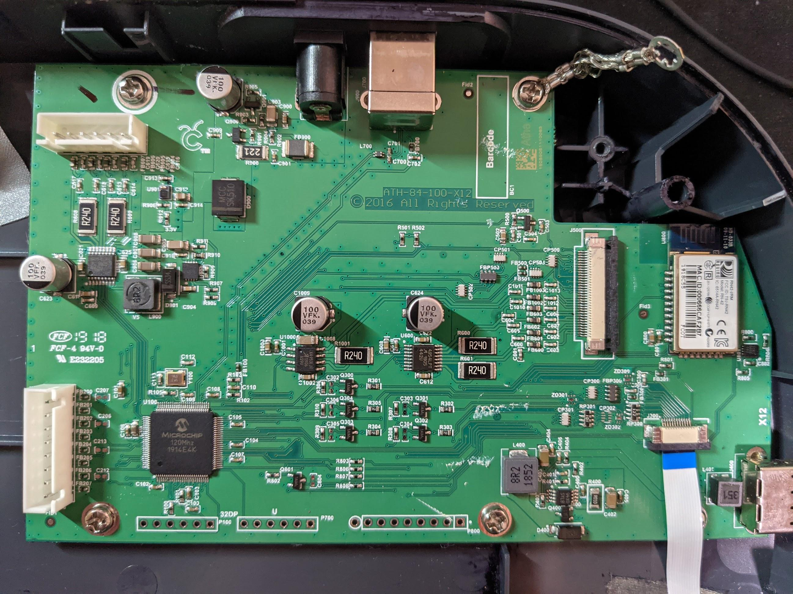
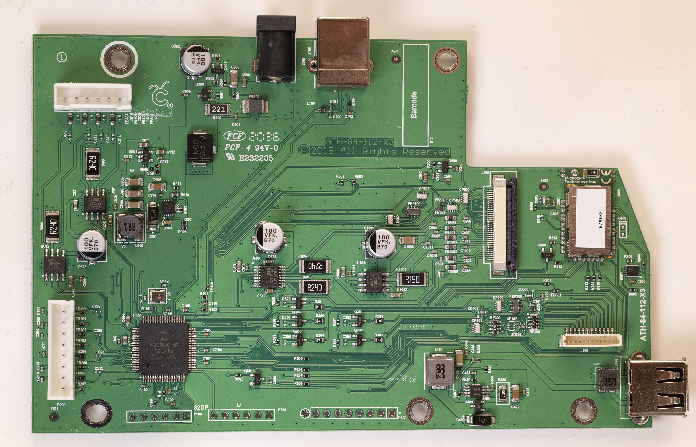
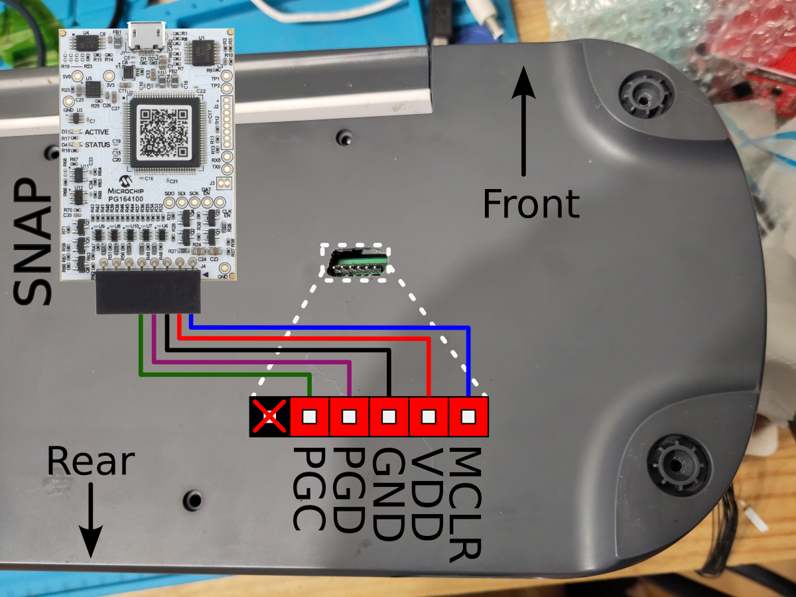
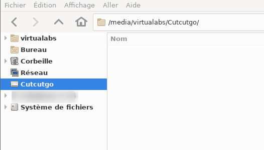

Flashing CutcutGo into your Cricut
==================================

Is my Cricut Maker Compatible ?
-------------------------------

.. |ATH-84-113-X1| image:: _static/images/pcb/ATH-84-113-X1.jpg
   :width: 20pt
   :height: 20pt
   :alt: The Maker 1 ATH-84-113-X1 PCB.

.. |SCM-84-100-X7| image:: _static/images/pcb/SCM-84-100-X7.jpg
   :width: 20pt
   :height: 20pt
   :alt: The Maker 3 SCM-84-100-X7 PCB.

+---------+---------+-----------------+----------------+------------------+-------------------+------------+
| Machine | Model # | S/N begins with | PCB revision   | PCB              | MCU Reference     | Compatible |
+=========+=========+=================+================+==================+===================+============+
| Maker 1 | CXPL301 | ?               | ATH-84-100-X12 | |ATH-84-100-X12| | PICxxxxxxxxxxxx   | NOT YET    |
+---------+---------+-----------------+----------------+------------------+-------------------+------------+
| Maker 1 | CXPL301 | Q               | ATH-84-112-X3  | |ATH-84-110-X2|  | ???               | ???        |
+---------+---------+-----------------+----------------+------------------+-------------------+------------+
| Maker 1 | CXPL301 | Q               | ATH-84-112-X3  | |ATH-84-112-X3|  | PIC32MX470F512L   | YES        |
+---------+---------+-----------------+----------------+------------------+-------------------+------------+
| Maker 1 | CXPL301 | T               | ATH-84-113-X1  | |ATH-84-113-X1|  | PIC32MK1024MCF100 | NOT YET    |
+---------+---------+-----------------+----------------+------------------+-------------------+------------+
| Maker 3 | CXPL303 | M               | SCM-84-100-X7  | |SCM-84-100-X7|  | PIC32MK1024MCF100 | NOT YET    |
+---------+---------+-----------------+----------------+------------------+-------------------+------------+

* If you own a Maker 1 with ATH-84-100-X12, please share your serial number.
* If you own a Maker with an unknown PCB, please share your serial number, pictures of your PCB, and the MCU reference if possible (using MPLAB IPE).

Prepare your Cricut Maker for programming
-----------------------------------------

In order to access the debug port of your Cricut Maker's PCB, you need to drill a
hole at a very specific position as shown below (drilling guide will come pretty soon
to help you).

.. image:: _static/images/setup/cutting-hole.jpg
    :width: 600
    :alt: A hole has been cut in a Cricut Maker plastic bottom case.

Solder a 6-pin male header to the main board debug interface on the bottom of the PCB,
as shown below.

.. image:: _static/images/setup/debug-connector.jpg
    :width: 600
    :alt: A 6-pin debug header soldered to the Cricut Maker main PCB

Install the PCB back into the case and reassemble the device.

.. image:: _static/images/setup/debug-pcb-installed.jpg
    :width: 600
    :alt: Main PCB screwed to the main bottom case.

.. _firmware_flashing:

Flashing the CutcutGo bootloader
--------------------------------

First, download and install `Microchip MPLABX <https://www.microchip.com/en-us/tools-resources/develop/mplab-x-ide>`_ on your
system. You will only need MPLabX' Integrated Programming Environment (IPE) utility to re-program the main micro-controller.
Download the `latest version of CutcutGo Bootloader <https://github.com/virtualabs/cutcutgo-bl/releases/tag/v2.0>`_ and save
it.

Connect 6 wires from the debug interface to a Microchip SNAP (or PicKit3), as shown below.

Connect your SNAP (or PicKit3) device into your computer, and launch MPLabX IPE.

.. image:: _static/images/setup/mplab-ipe-first-step.png
    :width: 600
    :alt: MPLabX IPE main view.

Follow these steps to connect your SNAP (or PicKit3) to MPLabX IPE:

1. Click on the *Operate* button on the left toolbar
2. Select the correct target MCU family: *32-bit MCUs (PIC32)*
3. Pick your device in the dropdown list: *PIC32MX470F512L*
4. Select your programmer (SNAP or PicKit3) in the tool dropdown list. If your device is not recognized, check your USB configuration
5. Click the *Connect* button

If your programmer is correctly recognized and connected, you would see something like the following:

.. image:: _static/images/setup/mplab-ipe-second-step.png
    :width: 600
    :alt: MPLabX IPE connected to our programmer.

When successfully connected, the *Connect* button turns into a *Disconnect* button.

Then, click on the *Browse* button as shown below and pick the bootloader *hex* file to program.
Click the *Program* button to upload the boootloader into the target micro-controller.

.. image:: _static/images/setup/mplab-ipe-third-step.png
    :width: 600
    :alt: MPLabX IPE HEX file selection dialog.

MPLabX IPE must outputs something like this:

.. image:: _static/images/setup/mplab-ipe-fourth-step.png
    :width: 600
    :alt: MPLabX IPE output after programming.

Flashing the CutcutGo application
---------------------------------

.. image:: _static/images/bootloader/buttons-off.png
    :width: 400

After flashing the bootloader, connect the Cricut Maker to your computer with an USB cable
and power on the Cricut Maker by a long-press on the power button while also pressing the pause button. The power button will
light up in red and the button below in white, indicating that the bootloader has started
and is waiting for some application file to be programmed.

.. image:: _static/images/bootloader/buttons-msd-on.png
    :width: 400

The Cricut Maker must appear as a USB thumb drive named "CutcutGo" on your host, as shown
below:

Download the `latest version of the CutcutGo application (UF2 file) <https://github.com/virtualabs/cutcutgo/releases/tag/latest>`_ to your computer and
copy it into the `Cutcutgo` drive. The Cricut Maker LEDs will blink during the copy, and reset
once programmed (all lEDs are then off). 

.. warning::

    An error may appear on the computer due to the sudden
    disconnection of the mass-storage device, but the firmware has been successfully programmed
    into the micro-controller.

Power up the Cricut Maker by a long-press on the power button, it will start the CutcutGo firmware and
you should see the power button LED light up in white.

.. image:: _static/images/bootloader/app-running.png
    :width: 400

Congratulations, you have successfully installed CutcutGo on your Cricut Maker !
