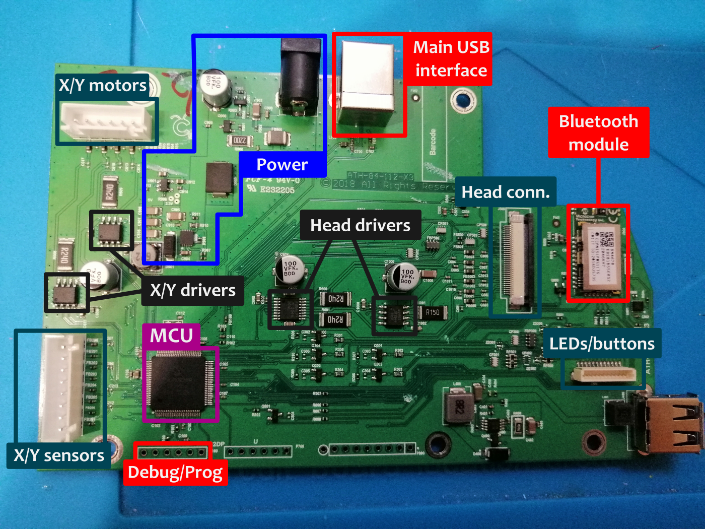
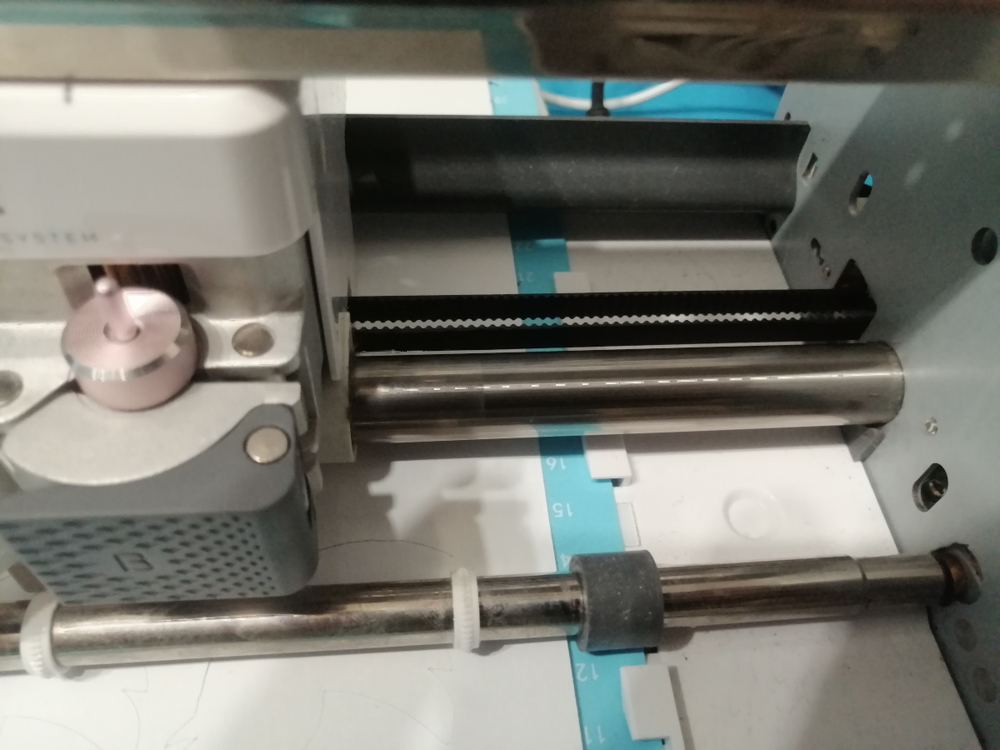

Teardown of the Cricut Maker Champagne
======================================

A low-cost CNC plotter
----------------------

The Cricut Maker seems to be a low-cost CNC plotter/cutter using cheap parts (servo motors, gears) but
relying on a strong metallic frame. Most of the plastic parts are injection-molded but somehow standards.

It does not use any ball bearing but some self-lubricating rings instead (for cost reduction).

Main PCB breakdown
------------------

The above PCB breakdown is from a Maker Champagne and contains
the following components:

* A PIC32 micro-controller (**MCU**)
* A set of DC motor drivers (**X/Y drivers**, **Head drivers**)
* A set of JST connectors to X/Y motors (**X/Y motors** and **X/Y sensors**)
* A power stage with regulators and a barrel jack connector (**Power**)
* A USB female connector used as the main communication channel with the host (**Main USB interface**)
* A connector for the cutting/tracing head (**Head conn.**)
* A bluetooth low energy module (**Bluetooth module**)
* A connector for the top LEDs and buttons PCB (**LEDs/buttons**)
* A debugging/programming connector (not populated, **Debug/Prog**)

PIC32 micro-controller
----------------------

This main PCB uses a PIC32MX-family micro-controller, namely a *PIC32MX470F512L*.
This is a 32-bit MCU with up to 512 KB of Flash memory and 128 KB of SRAM.

The datasheet is available `here <_static/documents/teardown/microchip-pic32mx470F512L.pdf>`_

Servo motors
------------

This Cricut Maker Champagne uses a set of servo motors using a quadrature encoder.
The markings have been used to find out `the exact model used <https://www.aliexpress.com/item/1005003551214085.html>`_.

.. image:: _static/images/teardown/servo-motor.webp
    :width: 400
    :alt: "Johnson" HC385MG-based servo-motor

This is basically a DC motor coupled with a quadrature encoder,
which is less precise than a stepper motor (like a NEMA17).

Bluetooth Low Energy module
---------------------------

The Cricut Maker relies on a Microchip *RN4678* Bluetooth/Bluetooth LE module driven by a dedicated
UART interface. **This module interface has not been totally reversed yet**.

The datasheet of this module is `available here <_static/documents/RN4678.pdf>`_

Mechanical details
------------------

X axis is driven through a set of reduction gears coupled to a belt that drives the tool head. 

.. image:: _static/images/teardown/X-axis-reduction-gears.jpg
    :width: 600
    :alt: X axis reduction gears

The machine
Y axis however, is driven only by a set of reduction gears and drive rollers.

.. image:: _static/images/teardown/Y-axis-reduction-gears.jpg
    :width: 600
    :alt: Y axis reduction gears
